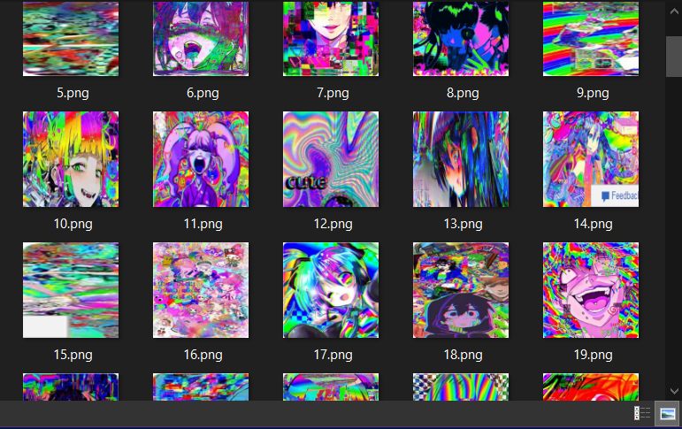
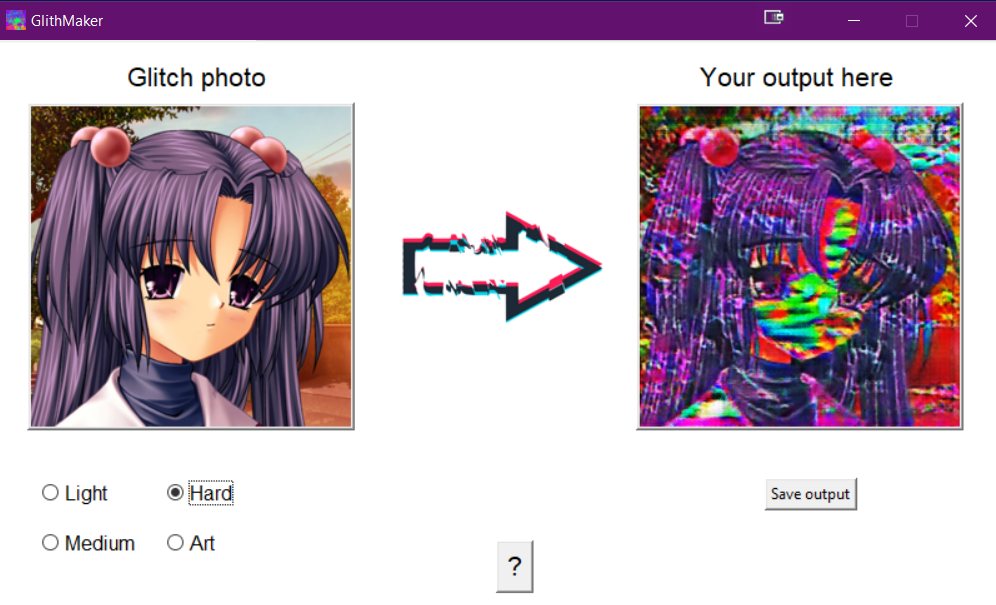
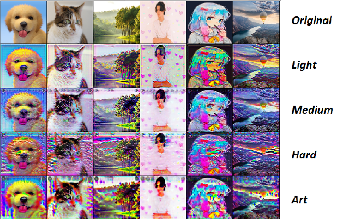

<p align="center">
	
	
  
</p>

# Glitch-net art application  

### Building custom images dataset using basic web-scrapping techniques with **Selenium** and testing it with CycleGAN, implemented in **PyTorch**.

<p align="center">
    
</p>

# Table of contents:
* [Overview](#overview)
* [Code details](#code-details)
* [Issues to solve](#issues)
* [Glitch-net's GUI](#GUI)
* [References](#refs)

## Overview <a name="overview"/></a>
This repo was created with the aim of demonstrating how to create a custom dataset of images from the internet. 
There are numerous datasets available, encompassing different types, themes, and varying quality levels. If you're having difficulty finding one for your personal project, I recommend visiting Kaggle, where you can access thousands of datasets

However, sometimes the data you need is too specific to be well-prepared on certain sources. In my example, I needed images representing the glitchcore effect for my class project. 
Well, there weren't datasets with such images, yet I could easily find them on the internet simply by searching Google Images for terms like 'glitchcore aesthetics.' That's precisely what we're going to do here.


## Code details & Issues to solve <a name='code-details'/></a>
To implement the automation of image search and download, we'll need:
 - **Selenium** for the main parts of this script;
 - **WebDriver Manager**, which will automatically download webdriver that we'll use for automatization task;
 - **PIL (Python Imaging Library)**, a package for working with and editing images in Python.

Talking about Selenium - this library is actually pretty easy to use because it imitates users' interactions with the browser. So, all you need to do to write Selenium code logic is to think about what you did to find an image.

Here is the whole project's step-by-step logic translated into the language of Selenium:
1) Open Broswer
```python
# Setting selenium's driver and basic URLs
chromedriver = ChromeDriverManager().install()
driver = webdriver.Chrome(chromedriver)
```
2) Go to Images sesction
```python
driver.get(EDGE_IMAGES_URL)
```
3) Choose _reject_ on annoying cookies permission
```python
##close edges's cookies premission
time.sleep(2)
driver.find_element_by_xpath('//*[@id="bnp_btn_reject"]').click()
```
4) Click on the Search bar
```python
##search bar html xpath
sb_xpath = '//*[@id="sb_form_q"]'
box = driver.find_element_by_xpath(sb_xpath)
```
5) Search for images that you are interested in
```python
##input and enter search result
SEARCH_BAR_TEXT = 'glitchcore aesthetic'
box.send_keys(SEARCH_BAR_TEXT)
box.send_keys(Keys.ENTER)
```
6) Download images
```python
# Finding and saving image by xpath
image_xpath = f'//*@id="mmComponent_images_2"]/ul[{im_row}]/li[{im_column}]/div/div[1]/a/div/img'
driver.find_element_by_xpath(image_xpath).click()
SAVE_PATH = f'D:\Python_Work\glitch_net\dataset\girls\{str(im_index)}.png'
driver.find_element_by_xpath(image_xpath).screenshot(SAVE_PATH)

# Transforming the image
glitch_img = Image.open(SAVE_PATH)
glitch_img  = glitch_img.resize((ImgSize, ImgSize))
glitch_img.save(SAVE_PATH)
```

The main tricky parts here are the usage of _**time**_ module and the meaning of _magic_ _**XPath**_ values. 

We need to use _time_ module because of how web drivers and servers work. Apparently, almost every object on the webpage needs some time to load, and that's where ```time.sleep(sec)``` will help.
And what about these **_XPath_** addresses? These are the **links**, or **ids** if you prefer, that we'll use for Selenium navigation.

_Where to find and copy these XPath ids?_ To do that, all you need is the Developer Mode (F12) with the Inspect Button (Ctrl+Shift+C) to find the HTML representation of the object.

<p align="center">
	
</p>

After you've found all the element addresses to interact with them, all you have to do is to easily interact with them through Selenium's API. 

_Or is it_?


## Issues to solve <a name='issues'/></a>

These are the main **issues** I've faced, some of which have been resolved while others have not.:
1.	**Webdriver doesn't see browser as you are.** Even if you'll click on the web-page's element and copy its XPath, it doesnt guarantee that Selenium will see it.

  	Often you'll face the ```no such element: Unable to locate element``` error because of the fact, that object in which you are interested is overlapped by another web-object. For example, due to this issue, I had to write code in step 3) to close the 'cookies permission' window. 

  	Another example (a frustrating one): the Selenium script presented in this repository can only take screenshots of image previews, not download full-size images.  And yes, that's because I couldn't find a way to bypass the image's overlay container.
    
2.	**Sometimes, it's just easier to swith to another browser.**  Originally, I was testing my script via Chrome webdriver.  However, after attempting to navigate to an image on Google, I realized that they don't have proper indexing in their XPath. So, in the end, I wasn't able to write a well-functioning ```for loop``` with an ```f-string``` inside of it.
	
 	The solution? Just switch to Bing's images. They work in the way you expect them to. :)

3. 	**Scroll, and scroll, and...** Not all the images are instantly loaded when you are googling something. When interacting with a large number of images (~300 in my example), you'll want to get to the bottom of you browser for 100% of information.
  	To achieve that, I wrote an _auto-scroll_ script that will continuously scroll down the webpage until no more images are loaded:
```python
last_height = driver.execute_script('return document.body.scrollHeight')
Scroll_flag = False
while Scroll_flag:
    driver.execute_script('window.scrollTo(0,document.body.scrollHeight)')
    time.sleep(2)
    new_height = driver.execute_script('return document.body.scrollHeight')
    try:
        driver.find_element_by_xpath('//*[@id="islmp"]/div/div/div/div/div[5]/input').click()
        time.sleep(2)
    ...
    try:
	# Clicking on 'load more images' button
        driver.find_element_by_xpath('//*[@id="bop_container"]/div[2]/a').click()
    ...
```

## Glitch-net's GUI <a name='GUI'/></a>

You can test my Glitch-net app through a user-friendly GUI! There, you can easily apply one of the following _glitch styles_ to your photo:
 - **Light, Medium and Hard** modes, each with different scale of glitch intensity
 - **Art** mode with kind of unpredictable glitch effect (sometimes similar to the **Hard** one)
 - 
<p align="center">
	
</p>

_You can check more examples of usage clicking on ```?``` button:_

<p align="center">
	
</p>

Experiment with my app as well as with Selenium methods to get the best results in generating and web scraping different stuff! 


## References <a name='refs'/></a>

Links to resources that were used in the project:
 - [Anime face dataset](https://www.kaggle.com/datasets/splcher/animefacedataset/data) to train CycleGAN generator
 - [Medium article](https://medium.com/@dian.octaviani/method-1-4-automation-of-google-image-scraping-using-selenium-3972ea3aa248) about Selenium
 - [My implementation of CycleGAN](https://github.com/BasilKarol/ani-CycleGAN) architecture that was used as glitch-net Generator
