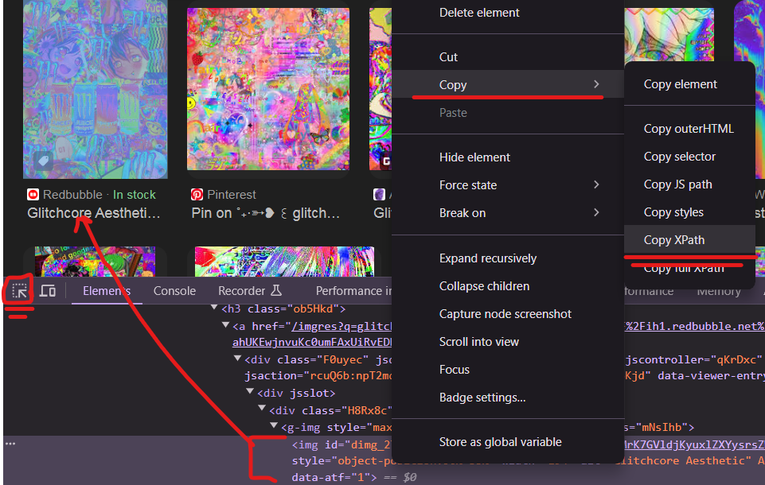

<p align="center">
	
	
  
</p>

# glitch-net-GAN

### Building custom images dataset using basic web-scrapping technuqies (**Selenium**) and testing it with CycleGAN (**Pytorch**).

<p align="center">
	
</p>

# Table of contents:
* [Overview](#overview)
* [Code details](#code-details)
* [Issues to solve](#issues)
* [Glitch-net's GUI](#GUI)
* [References](#refs)

## Overview <a name="overview"/></a>
This repo was created with an aim to show how to create custom dataset of images from the internet. 
There are a lot of datasets with different types and themes of data, as well as various quality. If you struggle with looking for one for your personal project, I do reccomend you to visit Kaggle, where you can find thousands of datasets. 

Hovewer, sometimes data that you need is too specific to find it well-prepared on some sources. In my example, I needed images represented _glitchcore_ effect for my class project. And there wasnt datasets with such images, but at the same time I could easily find one on the internet, just typing in search bar of Google images smth like _glitchcore aesthetics_. Well, that's exactly what we are gonna do here.

## Code details & Issues to solve <a name='code-details'/></a>
To implement the automatization of images search&download, we'll need:
 - **Selenium** for main parts of this scrpit
 - **WebDriver Manager**, that will automatically download webdriver that we'll use for automatization task
 - **PIL** - pillow package for working and editing images in Python

Talking about Selenium - this library is actually pretty easy to use because of the fact, that it actually imitates users interaction with the browser. So all you need to do to write selenium code logic is to think, what you've did to find and image? 

Here is whole project step-by-step logic translated into language of Selenium:
1) Open Broswer
```python
# Setting selenium's driver and basic URLs
chromedriver = ChromeDriverManager().install()
driver = webdriver.Chrome(chromedriver)
```
2) Go to Images sesction
```python
driver.get(EDGE_IMAGES_URL)
```
3) Choose _reject_ on annoying cookies premission
```python
##close edges's cookies premission
time.sleep(2)
driver.find_element_by_xpath('//*[@id="bnp_btn_reject"]').click()
```
4) Click on the Search bar
```python
##search bar html xpath
sb_xpath = '//*[@id="sb_form_q"]'
box = driver.find_element_by_xpath(sb_xpath)
```
5) Search for images that you are interested in
```python
##input and enter search result
SEARCH_BAR_TEXT = 'glitchcore aesthetic'
box.send_keys(SEARCH_BAR_TEXT)
box.send_keys(Keys.ENTER)
```
6) Download images
```python
# Finding and saving image by xpath
image_xpath = f'//*@id="mmComponent_images_2"]/ul[{im_row}]/li[{im_column}]/div/div[1]/a/div/img'
driver.find_element_by_xpath(image_xpath).click()
SAVE_PATH = f'D:\Python_Work\glitch_net\dataset\girls\{str(im_index)}.png'
driver.find_element_by_xpath(image_xpath).screenshot(SAVE_PATH)

# Transforming the image
glitch_img = Image.open(SAVE_PATH)
glitch_img  = glitch_img.resize((ImgSize, ImgSize))
glitch_img.save(SAVE_PATH)
```

The main tricky parts here are _**time**_ module usage and the meaning of _magic_ _**XPath**_ values. 

We need to use _time_ module because of how web -drivers and -servers work. Apparently, almost every object on the webpage need some time to load, that where ```time.sleep(sec)``` will help.
And what about these **_XPath_** adresses? These are the **links**, or **ids** if you prefer, that we'll use for Selenium navigation.

_Where to find and copy these XPath id's?_ To do that, all you need is the Developer Mode (F12) with Inspect Button (Ctrl+Shift+C) to find html representation of the object.

<p align="center">
	
</p>

After you've found all the element's adresses to interact with them, all you have to do is to easily interact with them through Selenium's API. 

_Or is it_?


## Issues to solve <a name='issues'/></a>

These are the main issues I've faced (resolved and not at all):
1.	**Webdriver doesnt see browser as you are.** Even if you'll klick on the web-page's element and copy it's XPath, it doesnt guarantee that Selenium will see it.

  	Often you'll face the ```no such element: Unable to locate element``` error because of the fact, that object in which you are interested is overlaped by another web-object. For example. because of this one issue I had to write code in step 3) to close 'cookies premission' window.

  	Another example (depressive one): Selenium script presented in this repo can only take screenshots from Images previews, not downloading full-size images. And yes, that's because I couldnt find a way to get over Image's overlay cantainer.
    
3.	**Sometimes, it's just easier to swith to another browser.**  Originally, I was testing my script via Chrome webdriver. Hovewer, after trying to navigate to an image in google, I realized that they dont have proper indexing in their XPath.
    So in the end, I just wasnt able to write fine-looking ```for loop``` with f-string inside of it.

  	The solution? Just swith to Bing's images. They do work in a way you expect them to :) 


## Glitch-net's GUI <a name='GUI'/></a>

You can test my Glitch-net app through user-friendly GUI! There, you can easily apply one of the following _glitch styles_ to your photo:
 - **Light, Medium and Hard** modes, each with different scale of glitch-intensity
 - **Art** mode with kind of unpredictable glitch effect (sometimes similar to the **Hard** one)
<p align="center">
	
</p>

_You can check more examples of usage clicking on ```?``` button:_

<p align="center">
	
</p>

Experiment with my app as well as with Selenium methods to get the best results in generating and web scrapping different stuff! 

## References <a name='refs'/></a>

Links to resources that were used in the project:
 - [Anime face dataset](https://www.kaggle.com/datasets/splcher/animefacedataset/data) to train CycleGAN generator
 - [Medium article](https://medium.com/@dian.octaviani/method-1-4-automation-of-google-image-scraping-using-selenium-3972ea3aa248) about Selenium
 - [My implementation of CycleGAN](https://github.com/BasilKarol/ani-CycleGAN) architecture that was used as glitch-net Generator
